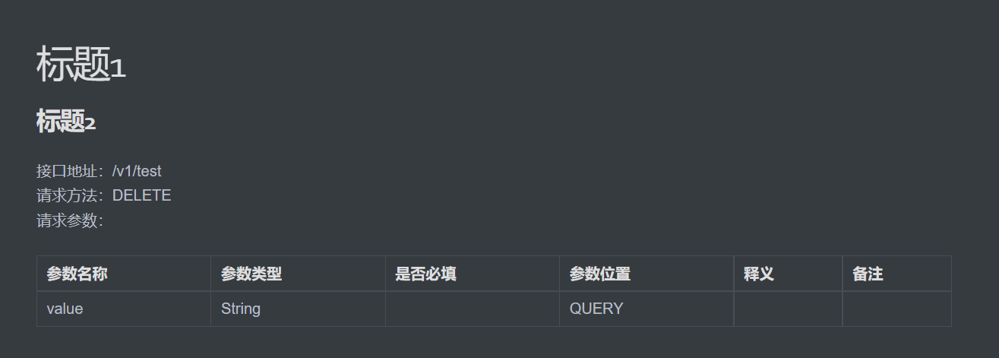

# Api文档生成Maven插件

基于SpringBoot+Swagger的文档生成插件

# 使用

1. 添加依赖

```xml
<plugin>
    <groupId>com.fool</groupId>
    <artifactId>api-document-tool-maven-plugin</artifactId>
    <version>1.0-SNAPSHOT</version>
    <configuration>
        <!-- 文档生成地址（文件夹） -->
        <apiDocumentSavePath>api/document</apiDocumentSavePath>
    </configuration>
</plugin>
```

2. 运行命令行（需要先compile)

```shell
mvn -e com.fool:api-document-tool-maven-plugin:1.0-SNAPSHOT:api-document-generate
```

# 示例

代码

```java
@Api(tags = "标题1")
@RestController
@RequestMapping(path = "/v1")
public class TestController {

    @ApiOperation("标题2")
    @RequestMapping(path = "/test", method = RequestMethod.DELETE)
    public void test(String value) {

    }

    
}
```

生成后的文档


